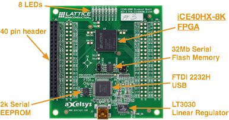
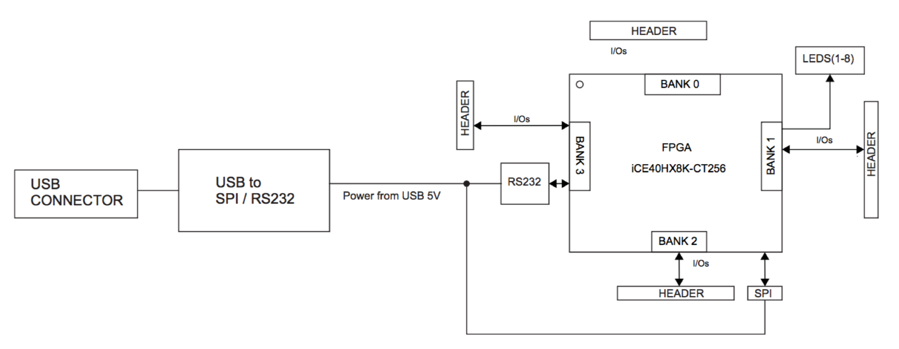

# iCE40HX8K #

<b style="color:red">Work in progress!</b>

[iCE40HX8K breakout board product page][0]

[Project IceStorm][icestorm]

## Breakout Board Overview ##

<figure>

<figcaption>Fig1. - Breakout board.</figcaption>

</figure>

<figure>

<figcaption>Fig2. - Breakout board block diagram. </figcaption>

</figure>

The images are taken from [\[1\]](#ref1).

## Hardware ##

| Component | Datasheet | Description | Package | Price |
|:----------|:---------:|:--------|:------------|------:|
| [LatticeSemi iCE40HX-8K CT256][2] | [pdf][2pdf] | FPGA, 7'680 logic cells, 128kbit RAM, 206 I/O | 256-LFBGA | [12.78](http://www.digikey.com/product-detail/en/lattice-semiconductor-corporation/ICE40HX8K-CT256/220-1575-ND/3083585) |
| [FTDI 2232HL][3] | [pdf][3pdf] | High Speed USB | 64-LQFP | [3.70](http://www.digikey.com/product-detail/en/ftdi-future-technology-devices-international-ltd/FT2232HL-REEL/768-1024-2-ND/1986053) |
| [Micron N25Q032A13ESC40][4] | [pdf][4pdf] | 32Mb, 3V, Multiple I/O Serial Flash Memory | SO8 | [0.50](http://www.digikey.com/product-detail/en/micron-technology-inc/N25Q032A13ESC40F/N25Q032A13ESC40F-ND/4072513) |
| [Microchip 93LC56][5]  | [pdf][5pdf] | 2k 2.5V Microwire Serial EEPROM | SO8 | [0.24](http://www.digikey.com/product-detail/en/microchip-technology/93LC56C-I-SN/93LC56C-I-SN-ND/572796)  ||
| [Linear Technology LT3030][6] | [pdf][6pdf] | Dual Linear Regulator | 20-TSSOP| [6.98](http://www.digikey.com/product-search/en?keywords=LT3030EFE%23TRPBF) |

TOTAL: $24.20
 
 

## I/O ##

	

## References ##

+ \[1\] iCE40-HX8K Breakout Board User's Guide - [pdf][1pdf]
+ \[2\] iCE40 LP/HX Family Data Sheet - [pdf][2pdf]
+ \[3\] FTDI FT2232H Dual High Speed USB to Multipurpose UART/FIFO IC - [page][3], [pdf][3pdf]
+ \[4\] Micron N25Q032A13ESC40 32Mb, 3V, Multiple I/O Serial Flash Memory - [page][4], [pdf][4pdf]
+ \[5\] Microchip 93LC56 2k 2.5V Microwire Serial EEPROM -  , [page][5], [pdf][5pdf]
+ \[6\] Linear Technology LT3030 Dual 750mA/250mA Low Dropout, Low Noise, Micropower Linear Regulator - [page][6], [pdf][6pdf]
+ \[7\] Lattice iCE40 LP/HX/LM products [page][2]
+ \[8\] iCE40 Development kits and boards [page][2]

[0]: http://www.latticesemi.com/Products/DevelopmentBoardsAndKits/iCE40HX8KBreakoutBoard.aspx
[1pdf]: http://www.latticesemi.com/view_document?document_id=50373
[2]: http://www.latticesemi.com/Products/FPGAandCPLD/iCE40.aspx
[2pdf]: http://www.latticesemi.com/~/media/LatticeSemi/Documents/DataSheets/iCE/iCE40LPHXFamilyDataSheet.pdf
[3]: http://www.ftdichip.com/Products/ICs/FT2232H.htm
[3pdf]: http://www.ftdichip.com/Support/Documents/DataSheets/ICs/DS_FT2232H.pdf
[4]: https://www.micron.com/parts/nor-flash/serial-nor-flash/n25q032a13esc40f
[4pdf]: https://www.micron.com/~/media/documents/products/data-sheet/nor-flash/serial-nor/n25q/n25q_32mb_3v_65nm.pdf
[5]: http://www.microchip.com/wwwproducts/en/93LC56
[5pdf]: http://ww1.microchip.com/downloads/en/devicedoc/21712B.pdf
[6]: http://www.linear.com/product/LT3030
[6pdf]: http://cds.linear.com/docs/en/datasheet/3030fa.pdf
[7]: http://www.latticesemi.com/Products/DevelopmentBoardsAndKits.aspx#s=~_d0!2!1!!1!7!0!1!!2!!!0!1!3!2!_d2!fvf%7C%40productitemnames!_d6!353!sbf!ErDrsryrurzqFqxpvtpBpwpqCqxpvspwpypApvtpwpwpqqrzqqqrsr!%40sitecoreorder!_d0!4!Lattice+Development+kits!iCE40+LP/HX/LM!_d1!_d8!!yqHqtFpGpxpvppupxpupvpupwppwpppupKpvpJpIpEpzpBpApCppDpqyprpqsq!
[icestorm]: http://www.clifford.at/icestorm/
[runningZPU]: http://sigalrm.blogspot.ch/2014/04/running-zpu-softcore-on-lattice-ice40.html
