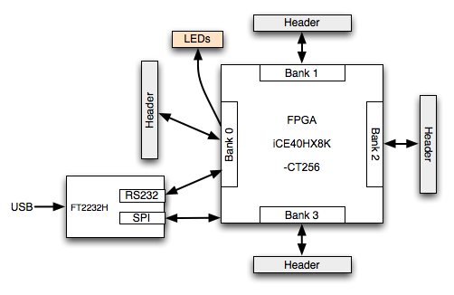
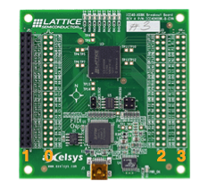

# iCE40HX-8K #

<b style="color:red">Work in progress!</b>


[iCE40HX-8K breakout board product page][0]

[Project IceStorm][icestorm]

[Run ZPU][runningZPU], [source code][ZPU-lattice]

[Messing with a iCE40HX-8K FPGA][blogospheric].

The [physical constraint file](ice40hx8k.pcf) (pcf).

## Comparison ##

| Board                  | FPGA       | Package | IO  | PLL | Clock | Price |
|------------------------|------------|---------|-----|:---:|-------|-------|
| Nandland Go            | iCE40HX-1K | VQ100   |     | 0   | 30MHz |  60$  |
| iCEstick               | iCE40HX-1K | TQ144   |     | 1   | 12MHz |  26$  |
| **iCE40HX8K breakout** | iCE40HX-8K | CT256   |     | 2   | 12MHz |  50$  |

The [Zylin ZPU][ZPU] requires at about 2.5k logic cells/500 logic tiles so the
iCE40HX-1K boards won't suffice for that.

Also interesting: [Dipsy](http://dipsy.cool) sub-5$ UL1K breakout board.
 

## Breakout Board Overview ##

<figure>
<div style="text-align: center">

<figcaption>Fig1. - Breakout board.</figcaption>
</div>
</figure>

<figure>
<div style="text-align: center">

<figcaption>Fig2. - Breakout board block diagram (from [\[1\]](#ref1)). </figcaption>
</div>
</figure>

<figure>
<div style="text-align: center">

<figcaption>Fig3. - I/O Banks.</figcaption>
</div>
</figure>

The images are taken from [\[1\]](#ref1).

### UART ###

Channel B of the FT2232H has a UART interface that is connectected to 
bank 0 of the iCE40:

| UART (FTDI Channel B)   | Pin |
|-------------------------|-----|
| `RS232_Rx_TTL`          | B12 |
| `RS232_Tx_TTL`          | B10 |
| `RTSn`                  | B13 |
| `CTSn`                  | A15 |
| `DTRn`                  | A16 |
| `DSRn`                  | B14 |
| `DCDn`                  | B15 |

Note that `RX` and `TX` are from the point of view of the FT2232H.

### Testpoints ###

The board has 16 testpoints.

| TP#    | Description |
|-------:|-------------|
|  TP1   | `3V3` |
|  TP2   | `1V2` |
|  TP3   | `GND` |
|  TP4   | `VCCIO0` |
|  TP5   | `VCCIO0` after pullup  |
|  TP6   | `PLLVCC0` |
|  TP7   | `PLLVCC0` after pullup |
|  TP8   | `VCCIO1` |
|  TP9   | `VCCIO1` after pullup |
| TP10   | `VCCIO2` |
| TP11   | `VCCIO2` after pullup |
| TP12   | `PLLVCC2` |
| TP13   | `PLLVCC2` after pullup |
| TP14   | `VCCIO3` |
| TP15   | `VCCIO3` after pullup |
| TP16   | `CRESET_B` |


## Hardware ##

| Component | Datasheet | Description | Package | Price |
|:----------|:---------:|:--------|:------------|------:|
| [LatticeSemi iCE40HX-8K CT256][2] | [pdf][2pdf] | FPGA, 7'680 logic cells, 128kbit RAM, 206 I/O | 256-LFBGA | [12.78](http://www.digikey.com/product-detail/en/lattice-semiconductor-corporation/ICE40HX8K-CT256/220-1575-ND/3083585) |
| [FTDI 2232HL][3] | [pdf][3pdf] | High Speed USB | 64-LQFP | [3.70](http://www.digikey.com/product-detail/en/ftdi-future-technology-devices-international-ltd/FT2232HL-REEL/768-1024-2-ND/1986053) |
| [Micron N25Q032A13ESC40][4] | [pdf][4pdf] | 32Mb, 3V, Multiple I/O Serial Flash Memory | SO8 | [0.50](http://www.digikey.com/product-detail/en/micron-technology-inc/N25Q032A13ESC40F/N25Q032A13ESC40F-ND/4072513) |
| [Microchip 93LC56][5]  | [pdf][5pdf] | 2k 2.5V Microwire Serial EEPROM | SO8 | [0.24](http://www.digikey.com/product-detail/en/microchip-technology/93LC56C-I-SN/93LC56C-I-SN-ND/572796)  ||
| [Linear Technology LT3030][6] | [pdf][6pdf] | Dual Linear Regulator | 20-TSSOP| [6.98](http://www.digikey.com/product-search/en?keywords=LT3030EFE%23TRPBF) |

TOTAL: $24.20
 
 

## I/O ##
@todo

## Rotary encoder ##
See the folder [rotary_enc/](rotary_enc).

## Infrared ##
See the folder [infrared/](infrared).

## PLL ##
See the iCE40 sysCLOCK PLL Design and Usage Guide <a href="#ref8">\[8\]</a>.

## UART ##
See the folder [uart/](uart).

## DAC ##
See the folder [dac/](dac).

## ADC ##
See the folder [adc/](adc).

## Tools, Editors, IDEs ##

### Atom (Mac OS X)  ###
- [*Atom* editor](https://atom.io/) for Mac OS X.
- The [*linter-verilog*](https://atom.io/packages/linter-verilog) Atom plugin uses [Icarus Verilog](#icarus-verilog).
- The [*language-verilog*](https://atom.io/packages/language-verilog) plugin adds syntax highlighting and snippets to Verilog files.

### IDEs ###
- [APIO Experimental open source micro-ecosystem for open FPGAs](https://github.com/FPGAwars/apio)
- [APIO IDE for](https://atom.io/packages/apio-ide) [Atom editor](https://atom.io).

### Icarus Verilog ###
[*Icarus Verilog*](http://iverilog.icarus.com) is a Verilog simulation and synthesis tool. It can parse Verilog 2005 (IEEE 1364-2005).
Start here: [http://iverilog.wikia.com/wiki/](http://iverilog.wikia.com/wiki/Main_Page). On Mac OS X install with [Homebrew](http://brew.sh):

```bash
brew install icarus-verilog
```

### GTKWave ###
"[*GTKWave*](http://gtkwave.sourceforge.net) is a fully featured GTK+ based wave viewer for Unix, Win32, and Mac OSX which reads LXT, LXT2, VZT, FST, and GHW files as well as standard Verilog VCD/EVCD files and allows their viewing."

On Mac OS X install with [Homebrew](http://brew.sh):

```bash
brew install homebrew/gui/gtkwave
```

## References ##

+ <a name="ref1"></a>\[1\] iCE40-HX8K Breakout Board User's Guide - [pdf][1pdf]
+ <a name="ref2"></a>\[2\] iCE40 LP/HX Family Data Sheet - [pdf][2pdf]
+ <a name="ref3"></a>\[3\] FTDI FT2232H Dual High Speed USB to Multipurpose UART/FIFO IC - [page][3], [pdf][3pdf]
+ <a name="ref4"></a>\[4\] Micron N25Q032A13ESC40 32Mb, 3V, Multiple I/O Serial Flash Memory - [page][4], [pdf][4pdf]
+ <a name="ref5"></a>\[5\] Microchip 93LC56 2k 2.5V Microwire Serial EEPROM -  , [page][5], [pdf][5pdf]
+ <a name="ref6"></a>\[6\] Linear Technology LT3030 Dual 750mA/250mA Low Dropout, Low Noise, Micropower Linear Regulator - [page][6], [pdf][6pdf]
+ <a name="ref7"></a>\[7\] Lattice iCE40 LP/HX/LM products [page][2]
+ <a name="ref8"></a>\[8\] iCE40 Development kits and boards [page][8]
+ <a name="ref9"></a>\[9\] iCE40 sysCLOCK PLL Design and Usage Guide [pdf][PLL]
+ <a name="ref10"></a>\[10\] iCEcube2 Design Software [page][icecube]
+ <a name="ref11"></a>\[11\] iCEcube2 2016-02 Tutorial [pdf][icecube_tut]


[0]: http://www.latticesemi.com/Products/DevelopmentBoardsAndKits/iCE40HX8KBreakoutBoard.aspx
[1pdf]: http://www.latticesemi.com/view_document?document_id=50373
[2]: http://www.latticesemi.com/Products/FPGAandCPLD/iCE40.aspx
[2pdf]: http://www.latticesemi.com/~/media/LatticeSemi/Documents/DataSheets/iCE/iCE40LPHXFamilyDataSheet.pdf
[3]: http://www.ftdichip.com/Products/ICs/FT2232H.htm
[3pdf]: http://www.ftdichip.com/Support/Documents/DataSheets/ICs/DS_FT2232H.pdf
[4]: https://www.micron.com/parts/nor-flash/serial-nor-flash/n25q032a13esc40f
[4pdf]: https://www.micron.com/~/media/documents/products/data-sheet/nor-flash/serial-nor/n25q/n25q_32mb_3v_65nm.pdf
[5]: http://www.microchip.com/wwwproducts/en/93LC56
[5pdf]: http://ww1.microchip.com/downloads/en/devicedoc/21712B.pdf
[6]: http://www.linear.com/product/LT3030
[6pdf]: http://cds.linear.com/docs/en/datasheet/3030fa.pdf
[7]: http://www.latticesemi.com/Products/DevelopmentBoardsAndKits.aspx#s=~_d0!2!1!!1!7!0!1!!2!!!0!1!3!2!_d2!fvf%7C%40productitemnames!_d6!353!sbf!ErDrsryrurzqFqxpvtpBpwpqCqxpvspwpypApvtpwpwpqqrzqqqrsr!%40sitecoreorder!_d0!4!Lattice+Development+kits!iCE40+LP/HX/LM!_d1!_d8!!yqHqtFpGpxpvppupxpupvpupwppwpppupKpvpJpIpEpzpBpApCppDpqyprpqsq!
[8]: http://www.latticesemi.com/breakoutboards#s=~_d0!2!1!!0!1!1!7!!2!!!0!1!2!_d2!3!%40sitecoreorder!_d6!W.+Europe+Standard+Time!661!HrFrsrErDrsryqIqxpvtpGpwpqBqxpvspwpCpApzpvtpwpwpqqryqqqrur!sbf!fvf%7C%40productitemnames!_d0!4!Lattice+Development+kits!iCE40+Ultra+/+UltraLite!iCE40+LP/HX/LM!_d8!_d1!!xqIqtGpHpwpvppupwpupvpupyppypppupLpMpJpKpFpwpBpvpCpzpApEppDpqxpspqrq!
[icestorm]: http://www.clifford.at/icestorm/
[runningZPU]: http://sigalrm.blogspot.ch/2014/04/running-zpu-softcore-on-lattice-ice40.html
[ZPU-lattice]: https://github.com/iabdalkader/zpu-lattice
[ZPU]: http://opensource.zylin.com/zpu.htm
[blogospheric]: https://stuartl.longlandclan.id.au/blog/2015/12/06/fpga-fun/
[PLL]: http://www.latticesemi.com/view_document?document_id=47778
[icecube]: http://www.latticesemi.com/en/Products/DesignSoftwareAndIP/FPGAandLDS/iCEcube2.aspx
[icecube_tut]: http://www.latticesemi.com/view_document?document_id=51526

-------------------------------------------------------------------------------
<div style="text-align:right">
<a href="https://creativecommons.org/licenses/by-sa/4.0/">CC BY-SA 4.0</a>
&copy; <a href="http://mcmayer.net">Markus Mayer</a>
</div>