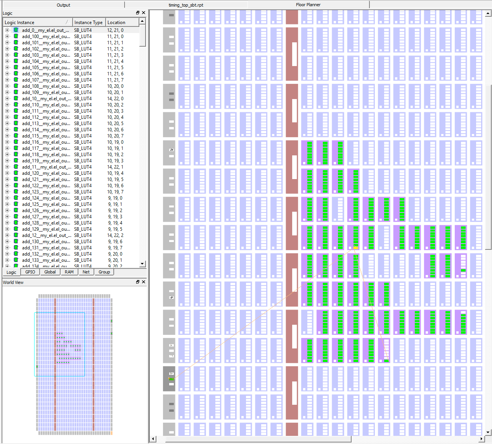
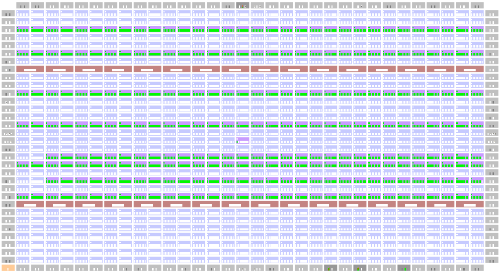

# Timing Experiments #

## Intro

The goal is to create delay lines from basic building blocks (such as `not`, `and` and *carry blocks*) and deduce the delay time.

This is done by feeding the clock and the delayed clock to the IO where the total propagation delay is measured with an oscilloscope.

## Delay of a LUT ##

**Results:**

| N    | Δt/ns 'inv' | Δt/ns 'and' |
| ---- | ----------- | ----------- |
| 50   | 13.2        |             |
| 100  | 26.4        |             |
| 150  | 35.2        | 36.0        |
| 200  | 52.4        |             |
| 250  | 66.0        | 59.6        |
| 300  | 78.0        |             |
| 350  | 89.6        | 86.4        |
| 400  | 103.2       |             |
| 500  |             | 115.2       |

The data can be found in [measurements-data.R](measurements-data.R).

| function | delay |
| -------- | ----- |
| invert   | 258ps |
| and      | 236ps |

<figure>

<figcaption>Fig 1. - Ch. 1 (yellow) is CLK, Ch. 2 (blue) is the 
delayed signal after 250 LUTs (and).</figcaption>
</figure>

<figure>

<figcaption>Fig 2. - Floor planner result.</figcaption>
</figure>

## Delay of a carry logic ##
The oscillation method with 1000 carry blocks (and one invert) gives a 
frequency of 7.2191MHz, this implies a Δt = 1/7.2191MHz / 1000 / 2 = 69.3 ps.

<figure>

<figcaption>Fig 3. - Ch. 1 (yellow) is CLK, Ch. 2 (blue) is the 
socillating signal with a 1000 carry blocks delay.</figcaption>

</figure>

<figure>

<figcaption>Fig 4. - Floor planner result, the carry blocks are nicely lined up.</figcaption>
</figure>

## Todo ##

- Wave Union TDC: See "[The 10-ps Wave Union TDC: Improving FPGA
  TDC Resolution beyond Its Cell Delay](http://lss.fnal.gov/archive/2008/conf/fermilab-conf-08-498-e.pdf)" by *Jinyuan Wu* and *Zonghan Shi* .