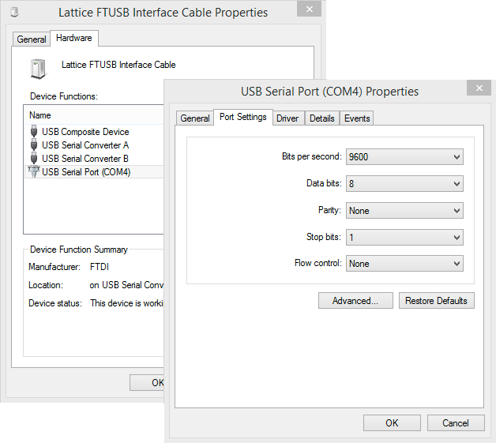
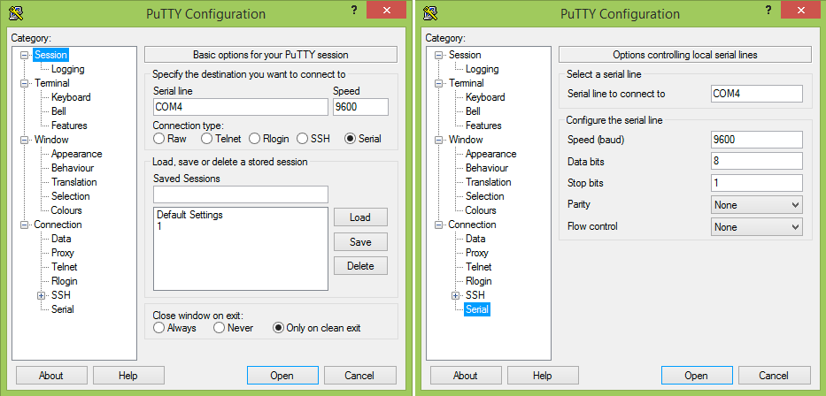

# UART #

I use the [*Open Source Documented Verilog UART*](http://opencores.org/project,osdvu) 
by Timothy Goddard. It is MIT licensed.

The source code on [github](https://github.com/cyrozap/osdvu.git)
and 
[opencores.org](http://opencores.org/websvn,filedetails?repname=osdvu&path=%2Fosdvu%2Ftrunk%2Fuart.v).

## HDL code ##

## Serial port setup ##
### Windows ###
Make sure the serial port settings are correct.
<figure>

<figcaption>Fig 1. Windows USB serial port settings.</figcaption>

</figure>

Use the terminal program [PuTTY](http://www.chiark.greenend.org.uk/~sgtatham/putty/).
<figure>

<figcaption>Fig 2. PuTTY configuration settings.</figcaption>

</figure>

### Mac OS X ###

## Other implementations ##
- Micro-UART by Jeung Joon Lee, 4/27/2001 (Verilog): [Source code](http://www.ie.itcr.ac.cr/achacon/taller_diseno_digital/Repositorio/micro-uart/u-uart.zip), [manual](http://www.ie.itcr.ac.cr/achacon/taller_diseno_digital/Repositorio/micro-uart/micro-uart.pdf)
- [LatticeSemi (VHDL)](http://www.latticesemi.com/en/Products/DesignSoftwareAndIP/IntellectualProperty/ReferenceDesigns/ReferenceDesign03/UART.aspx)